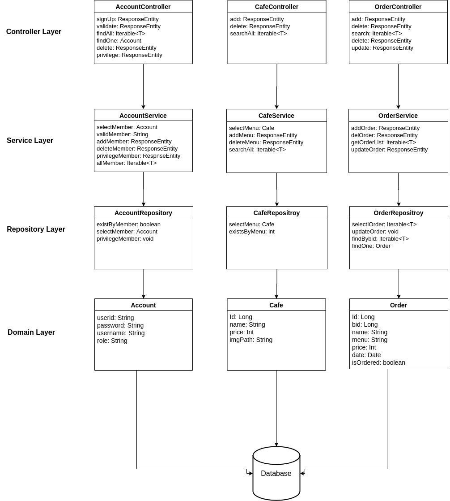

# MIDASMobile5-Server

## Overview

MIDAS Challenge 2018 모바일 5조 Server Application입니다.

 

## Tech

MIDAS Cafe 서버 애플리케이션은 아래의 기술 스택으로 개발되었습니다.

* **Language**: Java 8
* **Framework**: Spring Boot, Spring Security
* **DB**: MySQL 5.7, JPA
* **Other**: MQTT

 

## Requirements

해당 프로젝트의 요구 사항은 다음과 같습니다.

* 모바일 App을 이용하여 로그인을 한 후, 서버에서 주문이 이루어 지도록 구현.
* 관리자 계정을 통해 카페 오너가 직접 주문을 볼 수 있도록 구현.
* 주문이 완료되면, App에서 Push 알림이 갈 수 있도록 구현.

 

## Architecture

위의 요구 사항을 바탕으로 Spring boot를 이용해 아래의 스택으로 서버를 구현하였습니다.

 

데이터베이스는 MySQL을 사용하였고, 카페 주문에 필요한 계정, 카페 메뉴, 그리고 주문에 대한 도메인을 만들고, 회원 가입, 로그인 등의 회원 기본 기능, 카페 메뉴 추가, 검색 기능은 JPA의 기본 메소드를 사용하거나 약간의 튜닝을 하였으며 주문의 경우, 사용자 이름 칼럼을 넣고, 각 메뉴마다 주문이 되도록 구현하였습니다.

 

## How it works

모든 주문은 스마트폰 앱에서 이루어지며, 주문이 완료되면, 서버에서는 해당 계정 이름을 Topic으로 하여 MQTT 미들웨어에 Broker를 추가합니다.

카페 오너가 주문 완료 API를 호출하면, MQTT 브로커에 완료 메시지를 보내고, 사용자는 Broker에 담겨진 메시지를 확인하여, 주문하는 방식으로 운영됩니다.