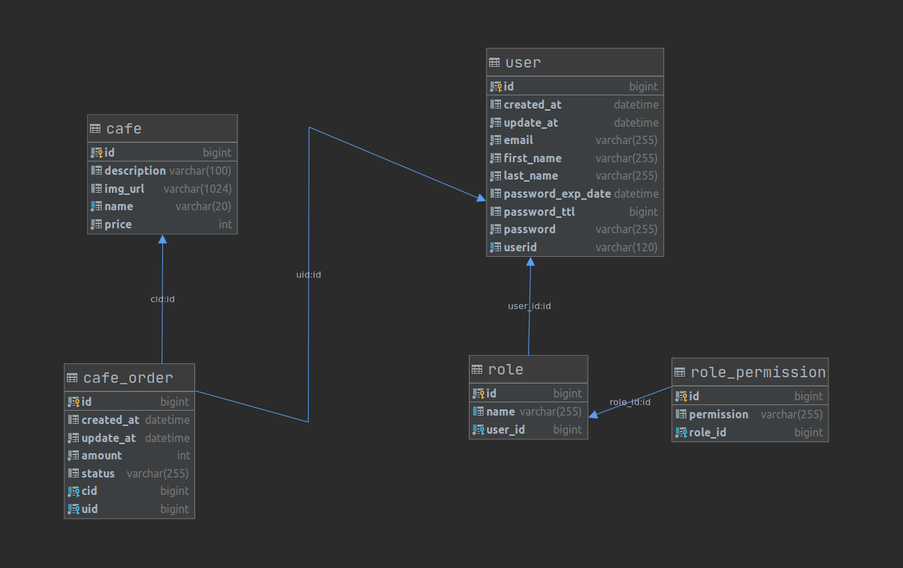
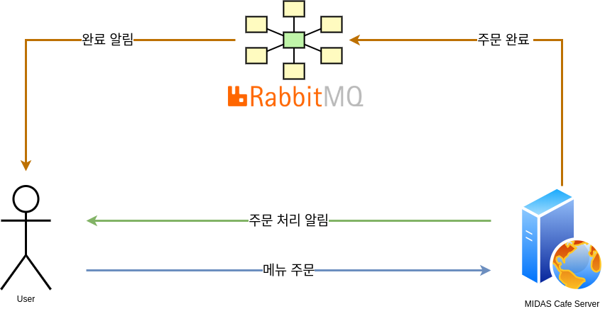

# MIDASMobile5-Server

## Overview

MIDAS Challenge 2018 모바일 5조 Server Application입니다.

 

## Tech

MIDAS Cafe 서버 애플리케이션은 아래의 기술 스택으로 개발되었습니다.

* **Language**: Java 8
* **Framework**: Spring Boot, Spring Security
* **DB**: MySQL 5.7
* **Other**: JPA, JWT, QueryDSL, RabbitMQ

 

## Requirements

해당 프로젝트의 요구 사항은 다음과 같습니다.

* 모바일 App을 이용하여 로그인을 한 후, 서버에서 주문이 이루어 지도록 구현.
* 관리자 계정을 통해 카페 오너가 직접 주문을 볼 수 있도록 구현.
* 주문이 완료되면, App에서 Push 알림이 갈 수 있도록 구현.

 

## ERD

ERD는 User (사용자), Cafe(카페 메뉴), Cafe_order(주문) 이렇게 3개의 엔티티를 중심으로 설계하였고, 사용자 테이블에 필요한 권한은 Role 테이블로 구성하였습니다.

 

## How it works

모든 주문은 스마트폰 앱에서 이루어지며, 새로운 주문이 들어오거나, 주문 메뉴의 준비가 완료된 경우, 서버에서는 해당 계정 이름을 Topic으로 하여 RabbitMQ에 메시지를 전송하며, 사용자와 괸리자 간 실시간 통신이 가능하도록 구현하였습니다.

카페 오너가 주문 완료 API를 호출하면, MQTT 브로커에 완료 메시지를 보내고, 사용자는 Broker에 담겨진 메시지를 확인하여, 주문하는 방식으로 운영됩니다.